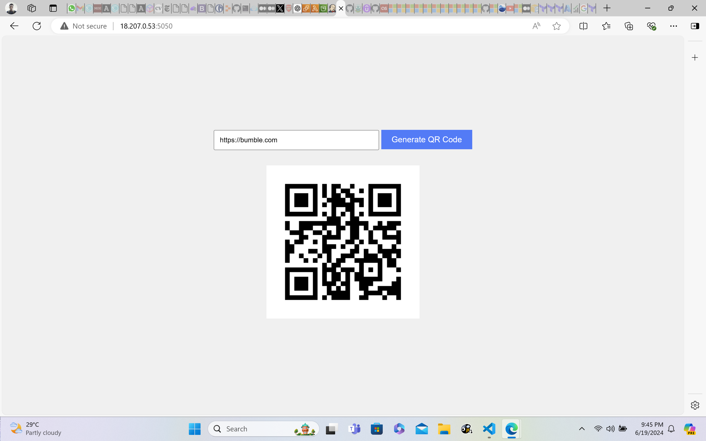

# Serverless QR Code Generator Using API Gateway Integration With Lambda and S3

The aim of this project was to create a serveless static website that generates QR code images for users once the fully qualified domain name (DNS) is provided. To achieve this, three "serverless" AWS services were employed:

- API Gateway
- Amazon S3
- AWS Lambda

These services were provisioned using a Jenkins CI Server that pulls the Terraform (IAC) file from the remote GitHub repository and automates the infrastructure.

## Step 1: Creating the Lambda Function
A Python script was created to this effect. It processess incoming HTTP requests, parses the supplied URL and generates a QR code image as a response. The lambda function was packaged as a zip file (__qr.zip__) and uploaded to an S3 bucket. To create the package, a python virtual environment was created:


### (i) Create a project directory
```bash
#!/bin/bash
mkdir qr/
cd qr/
```
### (ii) Setup Virtual Environment
A Python virtual environment was created in the project directory
```bash
python3 -m venv venv
source venv/bin/activate
```

### (iii) Installation of Required Libraries
The __qrcode__ library was installed using __pip__. It enables the lambda function to be able to call qrcode as a module.

```bash
pip install qrcode[pil] -t .
```

### (iv) Lambda Code
Code for the Lambda function was written to the file __lambda_function.py__:

```python
#!/usr/bin/env python3
import json
import boto3
import qrcode
import io
import base64
from urllib.parse import urlparse

# Initialize a session using Amazon S3
s3 = boto3.client('s3')

def lambda_handler(event, context):
    # Parse the URL from the event
    body = json.loads(event['body'])
    url = body['url']
    
    # Parse the URL using urlparse
    parsed_url = urlparse(url)
    netloc = parsed_url.netloc
    path = parsed_url.path

    # If the URL does not have a scheme (http/https), netloc will be empty
    if not netloc:
        netloc = parsed_url.path.split('/')[0]
        path = '/' + '/'.join(parsed_url.path.split('/')[1:])
    
    # Generate a unique filename
    filename = netloc.replace("/", "_") + path.replace("/", "_") + '.png'

    # Generate QR code
    img = qrcode.make(url)
    img_bytes = io.BytesIO()
    img.save(img_bytes)
    img_bytes = img_bytes.getvalue()
    
    # Upload the QR code to the S3 bucket
    s3.put_object(Bucket='rigas32', Key=filename, Body=img_bytes, ContentType='image/png')
    
    # Generate the URL of the uploaded QR code
    location = s3.get_bucket_location(Bucket='rigas32')['LocationConstraint']
    region = '' if location is None else f'{location}'
    qr_code_url = f"https://{'rigas32'}.s3.amazonaws.com/{filename}"
    
    # Construct response with CORS headers
    response = {
        'statusCode': 200,
        'headers': {
            "Access-Control-Allow-Headers" : "Content-Type",
            "Access-Control-Allow-Origin": "*",
            "Access-Control-Allow-Methods": "OPTIONS,POST,GET"
        },
        'body': json.dumps(qr_code_url)
    }
    
    return response
```
The __lambdafunction.py__ was saved to the __qr__ directory.
The directory was zipped as __qr.zip__ file:

```bash
zip -r9 qr.zip .
```
## Step 2: Terraform Scripts

Terraform was used to define the serverless infrastructure. This include uploading the __qr.zip__ file to a provisioned S3 bucket, creating a lambda function (__myqrcodegenerator__), and an edge-type Rest API Gateway (__QR CODE__).

## __resources.tf__

```Terraform
#Terraform provider block
terraform {
  required_providers {
    aws = {
      source  = "hashicorp/aws"
      version = "~> 5.0"
    }
  }
}

provider "aws" {
  region = "us-east-1"
}

#S3 Provisioning
resource "aws_s3_bucket" "mys3" {
  bucket = "rigas32"

  tags = {
    Name        = "My bucket"
    Environment = "Dev"
  }
}

#Bucket policy to allow CORS
resource "aws_s3_bucket_policy" "allow_public_access" {
  bucket = aws_s3_bucket.mys3.id
  policy = data.aws_iam_policy_document.allow_pub_access.json
}

data "aws_iam_policy_document" "allow_pub_access" {
  statement {
    principals {
      type        = "AWS"
      identifiers = ["*"]
    }

    actions = [
      "s3:GetObject"
    ]

    effect = "Allow"

    resources = [
      aws_s3_bucket.mys3.arn,
      "${aws_s3_bucket.mys3.arn}/*"
    ]
  }
}

#Set bucket ownership
resource "aws_s3_bucket_ownership_controls" "ownership" {
  bucket = aws_s3_bucket.mys3.id
  rule {
    object_ownership = "BucketOwnerPreferred"
  }
}

#Enable public S3 access
resource "aws_s3_bucket_public_access_block" "aclbucket" {
  bucket = aws_s3_bucket.mys3.id

  block_public_acls       = false
  block_public_policy     = false
  ignore_public_acls      = false
  restrict_public_buckets = false
}

resource "aws_s3_bucket_acl" "rigaacl" {
  depends_on = [
    aws_s3_bucket_ownership_controls.ownership,
    aws_s3_bucket_public_access_block.aclbucket,
  ]

  bucket = aws_s3_bucket.mys3.id
  acl    = "public-read"
}

#Lambda function
resource "aws_lambda_function" "my_lambda" {
  function_name    = "myqrcodegenerator"
  handler          = "lambda_function.lambda_handler"
  runtime          = "python3.12"
  memory_size      = 128
  timeout          = 10
  source_code_hash = filebase64sha256("${path.module}/qr.zip")
  s3_bucket        = aws_s3_bucket.mys3.id
  s3_key           = aws_s3_bucket_object.mylambda_zip.key

  #Use existing role
  role = "arn:aws:iam::975049925614:role/service-role/python2-role-6z6ifmb5"

  environment {
    variables = {
      key = "value"
    }
  }
}

#Upload lambda package qr.zip to S3
resource "aws_s3_bucket_object" "mylambda_zip" {
  bucket       = aws_s3_bucket.mys3.id
  key          = "qr.zip"
  source       = "${path.module}/qr.zip"
  etag         = filemd5("${path.module}/qr.zip")
  content_type = "application/zip"
}

#API gateway creation
resource "aws_api_gateway_rest_api" "api" {
  name        = "QRAPI"
  description = "API for QR Code Generation"
}

resource "aws_api_gateway_resource" "qr_code_resource" {
  rest_api_id = aws_api_gateway_rest_api.api.id
  parent_id   = aws_api_gateway_rest_api.api.root_resource_id
  path_part   = "qr-code"
}

#POST method
resource "aws_api_gateway_method" "post_method" {
  rest_api_id   = aws_api_gateway_rest_api.api.id
  resource_id   = aws_api_gateway_resource.qr_code_resource.id
  http_method   = "POST"
  authorization = "NONE"
}


resource "aws_api_gateway_integration" "lambda_integration" {
  rest_api_id             = aws_api_gateway_rest_api.api.id
  resource_id             = aws_api_gateway_resource.qr_code_resource.id
  http_method             = aws_api_gateway_method.post_method.http_method
  integration_http_method = "POST"
  type                    = "AWS_PROXY"
  uri                     = aws_lambda_function.my_lambda.invoke_arn
}

#Allow Lambda Invocation
resource "aws_lambda_permission" "apigateway_invoke" {
  statement_id  = "AllowAPIGatewayInvoke"
  action        = "lambda:InvokeFunction"
  function_name = aws_lambda_function.my_lambda.function_name
  principal     = "apigateway.amazonaws.com"

  source_arn = "arn:aws:execute-api:us-east-1:975049925614:${aws_api_gateway_rest_api.api.id}/*/*"
}

resource "aws_api_gateway_method_response" "response_200" {
  rest_api_id = aws_api_gateway_rest_api.api.id
  resource_id = aws_api_gateway_resource.qr_code_resource.id
  http_method = aws_api_gateway_method.post_method.http_method
  status_code = "200"

  response_models = {
    "application/json" = "Empty"
  }
  response_parameters = {
    "method.response.header.Access-Control-Allow-Origin"  = true,
    "method.response.header.Access-Control-Allow-Methods" = true,
    "method.response.header.Access-Control-Allow-Headers" = true
  }
}

resource "aws_api_gateway_integration_response" "response_200" {
  rest_api_id = aws_api_gateway_rest_api.api.id
  resource_id = aws_api_gateway_resource.qr_code_resource.id
  http_method = aws_api_gateway_method.post_method.http_method
  status_code = aws_api_gateway_method_response.response_200.status_code

  response_templates = {
    "application/json" = "#set($origin = $input.params().header.get('Origin'))\n#if($origin)\n  #set($context.responseOverride.header.Access-Control-Allow-Origin = $origin)\n#end\n{}"
  }
  response_parameters = {
    "method.response.header.Access-Control-Allow-Origin"  = "'*'",
    "method.response.header.Access-Control-Allow-Headers" = "'Content-Type,X-Amz-Date,Authorization,X-Api-Key,X-Amz-Security-Token'",
    "method.response.header.Access-Control-Allow-Methods" = "'GET,OPTIONS,POST,PUT'"
  }
  depends_on = [aws_api_gateway_integration.lambda_integration]
}

#OPTIONS method
resource "aws_api_gateway_method" "options_method" {
  rest_api_id   = aws_api_gateway_rest_api.api.id
  resource_id   = aws_api_gateway_resource.qr_code_resource.id
  http_method   = "OPTIONS"
  authorization = "NONE"
}

resource "aws_api_gateway_method_response" "options_200" {
  rest_api_id = aws_api_gateway_rest_api.api.id
  resource_id = aws_api_gateway_resource.qr_code_resource.id
  http_method = aws_api_gateway_method.options_method.http_method
  status_code = "200"
  response_models = {
    "application/json" = "Empty"
  }
  response_parameters = {
    "method.response.header.Access-Control-Allow-Origin"  = true,
    "method.response.header.Access-Control-Allow-Methods" = true,
    "method.response.header.Access-Control-Allow-Headers" = true
  }
  depends_on = [aws_api_gateway_method.options_method]
}

resource "aws_api_gateway_integration" "options_integration" {
  rest_api_id             = aws_api_gateway_rest_api.api.id
  resource_id             = aws_api_gateway_resource.qr_code_resource.id
  http_method             = aws_api_gateway_method.options_method.http_method
  type                    = "MOCK"
  integration_http_method = "POST"
  request_templates = {
    "application/json" = "{\"statusCode\": 200}"
  }
  depends_on  = [aws_api_gateway_method.options_method]
}

#Configure OPTIONS method for CORS
resource "aws_api_gateway_integration_response" "options_integration_response" {
  rest_api_id = aws_api_gateway_rest_api.api.id
  resource_id = aws_api_gateway_resource.qr_code_resource.id
  http_method = aws_api_gateway_method.options_method.http_method
  status_code = aws_api_gateway_method_response.options_200.status_code
  response_parameters = {
    "method.response.header.Access-Control-Allow-Headers" = "'Content-Type,X-Amz-Date,Authorization,X-Api-Key,X-Amz-Security-Token'",
    "method.response.header.Access-Control-Allow-Methods" = "'GET,OPTIONS,POST,PUT'",
    "method.response.header.Access-Control-Allow-Origin"  = "'*'"
  }
  depends_on = [aws_api_gateway_method_response.options_200]
}

#Deploy API to Stage 1
resource "aws_api_gateway_deployment" "deployment" {
  depends_on = [aws_api_gateway_integration.lambda_integration]

  rest_api_id = aws_api_gateway_rest_api.api.id
  stage_name  = "stage1"
}

output "api_url" {
  value = aws_api_gateway_deployment.deployment.invoke_url
}
```

## Step 3: HTML File

An HTML file was created using basic HTML and minimal styling (Javascript). The HTML file inluded a "__GENERATE QR CODE__" button that makes a POST API call to the Lambda backend once a user provides a domain name in the spacebar next to it. The QR code image is also printed on the screen

```HTML
<!DOCTYPE html>
<html lang="en">
<head>
    <meta charset="UTF-8">
    <meta name="viewport" content="width=device-width, initial-scale=1.0">
    <title>QR Code Generator</title>
    <style>
        body {
            font-family: Arial, sans-serif;
            margin: 0;
            padding: 0;
            display: flex;
            justify-content: center;
            align-items: center;
            height: 100vh;
            background-color: #f0f0f0;
        }

        #container {
            text-align: center;
        }

        #urlInput {
            width: 300px;
            padding: 10px;
            margin-bottom: 10px;
        }

        #generateBtn {
            padding: 10px 20px;
            background-color: #007bff;
            color: #fff;
            border: none;
            cursor: pointer;
            font-size: 16px;
        }

        #qrCodeImage {
            margin-top: 20px;
            max-width: 300px;
        }
    </style>
</head>
<body>
    <div id="container">
        <input type="text" id="urlInput" placeholder="Enter URL">
        <button id="generateBtn">Generate QR Code</button>
        <div id="qrCodeContainer" style="display: none;">
            
        </div>
    </div>

    <script>
        document.getElementById('generateBtn').addEventListener('click', function() {
            var url = document.getElementById('urlInput').value.trim();
            if (url === '') {
                alert('Please enter a valid URL');
                return;
            }
            generateQRCode(url);
        });

        function generateQRCode(url) {
            fetch('myapi/qr-code', {
                method: 'POST',
                body: JSON.stringify({ url: url }),
                headers: {
                    'Content-Type': 'application/json'
                }
            })
            .then(response => {
                if (!response.ok) {
                    throw new Error('Network response was not ok');
                }
                return response.json();
            })
            .then(data => {
                var qrCodeUrl = data;
                document.getElementById('qrCodeImage').src = qrCodeUrl;
                document.getElementById('qrCodeContainer').style.display = 'block';
            })
            .catch(error => {
                console.error('Error:', error);
                alert('An error occurred while generating QR Code.');
            });
        }
    </script>
</body>
</html>
```

## Step 4: Jenkins CI

A Jenkins server was created using a t2.medium Ubuntu 22.04 instance (2vCPU and 16GB EBS disk). Steps for installing Jenkins can be found [here](https://www.digitalocean.com/community/tutorials/how-to-install-jenkins-on-ubuntu-20-04). Jenkins allows developers to build, test, and automate their workflows. The Jenkinsfile used for the task is outlined below:

```Groovy
pipeline {
    agent any
    
    environment {
        // Define AWS credentials for S3 bucket access
        AWS_ACCESS_KEY_ID = credentials('awscreds')
        AWS_SECRET_ACCESS_KEY = credentials('awscreds')
        GITLAB_CRED_ID = 'mygithubcreds'
    }
    
    stages {
        stage('Checkout') {
            steps {
                script {
                    // Global git configuration to disable SSL verification
                    sh 'git config --global http.sslVerify false'

                    // Checkout code from GitHub repository using credentials
                    checkout([$class: 'GitSCM', branches: [[name: 'master']], userRemoteConfigs: [[url: 'https://github.com/rigamortus/mynewrepo.git', credentialsId: env.GITLAB_CRED_ID]]])
                }
            }
        }

        stage('Terraform init') {
            steps {
                script {
                    // Initialize Terraform
                    sh 'terraform init'
                }
            }
        }

        stage('Terraform plan') {
            steps {
                timeout(time: 10, unit: 'MINUTES') {
                    script {
                        // Plan Terraform changes with verbose output and save to file
                        sh 'terraform plan -out=tfplan | tee terraform_plan_output.txt'
                    }
                }
            }
        }

        stage('Terraform apply') {
            steps {
                timeout(time: 20, unit: 'MINUTES') {
                    script {
                        // Apply Terraform changes with verbose output
                        sh 'terraform apply -auto-approve tfplan | tee terraform_apply_output.txt'
                    }
                }
            }
        }

        stage('Serve HTML') {
            steps {
                // Serve HTML file on port 5050 using Python's SimpleHTTPServer
                sh 'api_url=$(terraform output -raw api_url)'
                sh 'sed -i "s|myapi|$api_url|g" ./index.html'
                sh 'nohup python3 -m http.server 5050 > /dev/null 2>&1 &'
            }
        }
    }
}
```

## Step 5: Github Repository
A Github repository (__mynewrepo__) was created. On my local machine it was set as the remote upstream of my working directory:

```bash
git remote add origin https://github.com/rigamortus/mynewrepo.git
```
All configurations files were pushed to the main branch after committing them:

```bash
git push -u origin master
```

## Step 6: Pipeline Implementation
After storing AWS credentials ('awscreds') and Github credentials ('mygithubcred') in Jenkins, the pipeline was triggered sucessfully.

__Jenkins__:


## __AWS Resources__:

__EC2 Server__


__Lambda function__:


__API Gateway__:


__S3__:


__Final Result__:


__NOTE__: Ensure ports 8080, 5050, and 22 are opened on the security group attached to the EC2 Jenkins server.


